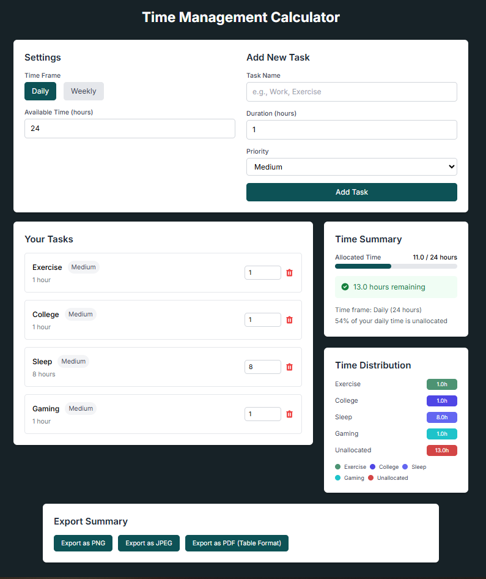

# ⏰ Time Management Calculator

A Next.js-powered tool to visualize and optimize your daily/weekly task allocation. Prioritize tasks, track overbooking, and export summaries as PNG, JPEG, or PDF.



Live Demo: [time-management-calculator.vercel.app](https://time-management-calculator.vercel.app/)

---

## ✨ Features

- ⏳ **Time Frames**: Switch between Daily (24h) or Weekly (168h) views.
- 📝 **Task Management**: Add tasks with custom durations and priorities (High/Medium/Low).  
- ⚠️ **Overbooking Alerts**: Real-time warnings when allocated time exceeds availability (e.g., 271h overbooked!).  
- 📊 **Visual Distribution**: Chart.js-powered breakdown of task time allocation.  
- 📤 **Export Options**: Save summaries as PNG, JPEG, or PDF (via jsPDF).  

---

## 🚀 Tech Stack

- **Framework:** [Next.js](https://nextjs.org/)
- **Language:** [TypeScript](https://www.typescriptlang.org/)
- **Styling:** [Tailwind CSS](https://tailwindcss.com/)
- **Charts:** [react-chartjs-2](https://react-chartjs-2.js.org/)
- **PDF Export:** [jsPDF](https://parall.ax/products/jspdf)
- **Image Export:** [html-to-image](https://github.com/bubkoo/html-to-image)
- **Deployment:** [Vercel](https://vercel.com/)

---

## 📦 Installation

```bash
git clone https://github.com/your-username/time-management-calculator.git  
```

```bash
cd time-management-calculator  
```

```bash
npm install
```

```bash
npm run dev
```

## 💌 Get In Touch

Thank you for checking out this project! If you have any questions, suggestions, would like to collaborate, or need my development services:

[](mailto:alicodespace@gmail.com)
[](https://www.linkedin.com/in/alirazaweb)
[](https://alicodez.vercel.app/)

⭐ Support the project by starring the repository!
[](https://github.com/Alirazahaider/time-management-calculator)
